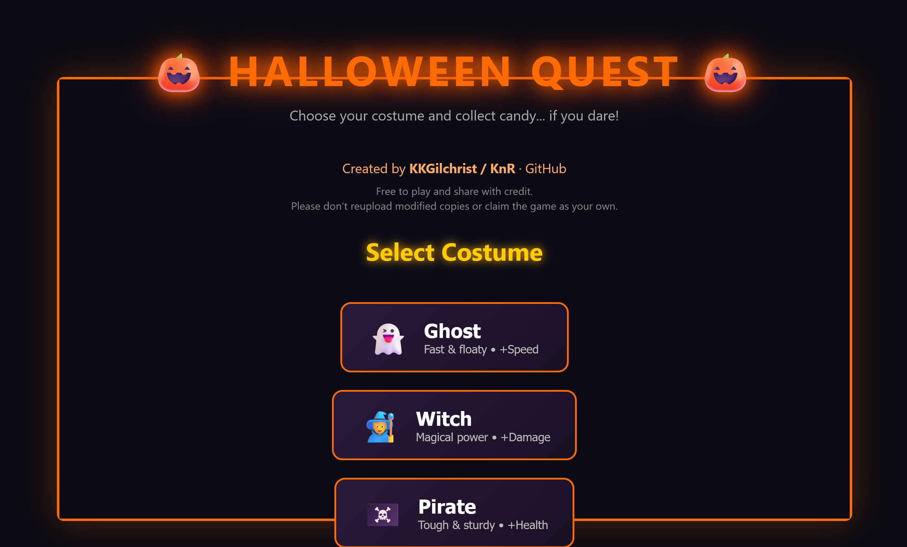
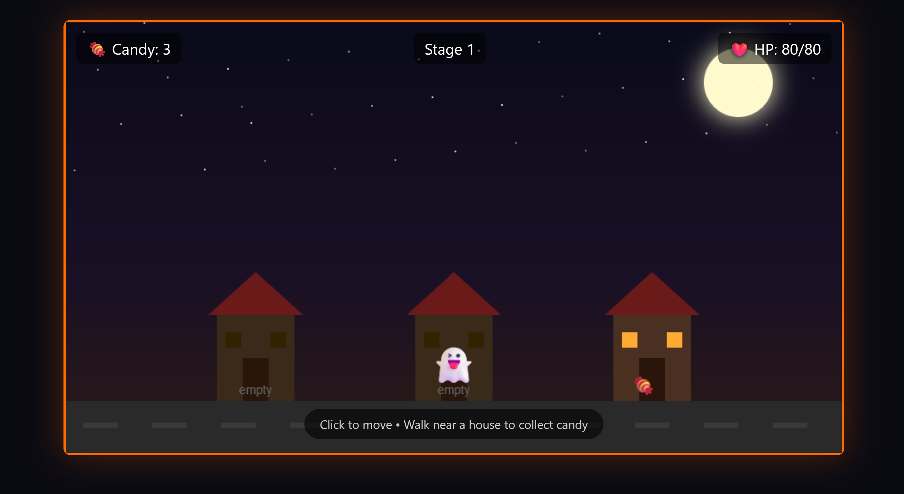
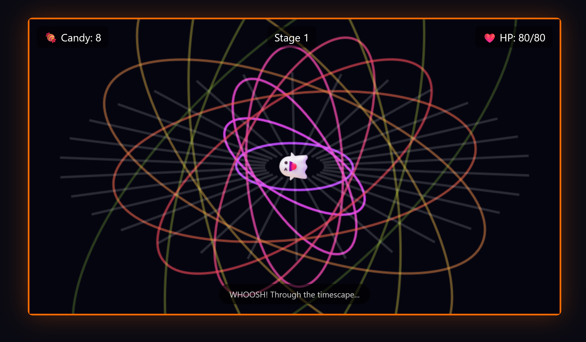
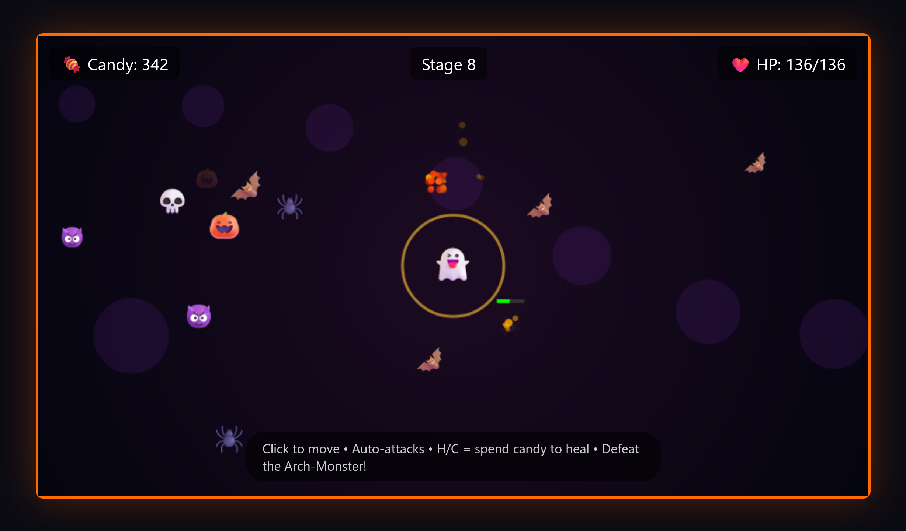
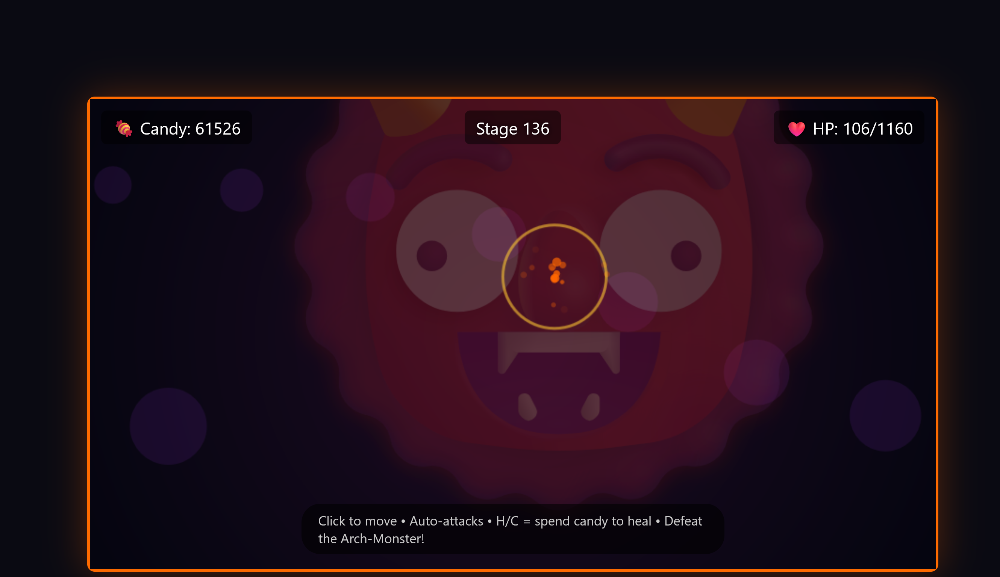

# 🎃 Halloween Candy Quest

**Play here:** [https://katykg.github.io/halloween-candy-quest](https://katykg.github.io/halloween-candy-quest)

A Halloween browser game: pick a costume, trick-or-treat down the street, then get pulled through a timescape tunnel into a monster realm where **Arch-Monsters** eat the smaller foes and grow stronger.

**Created by KKGilchrist / KnR**

---

## Screenshots

### Title — costume select

### Trick-or-treat

### Timescape tunnel

### Battle — mid run

### Late-game Arch-Monster

---

## Story & flow

1. **Choose a costume** — Ghost (speed), Witch (damage), or Pirate (health).
2. **Trick-or-treat** — Walk the road and collect candy from three houses.
3. **The glow** — Something appears in the distance; you run toward it.
4. **Timescape tunnel** — A spinning portal with a heavy whoosh.
5. **BOO!** — Then the battle begins.
6. **Monster realm** — Clear waves of small monsters. When few remain (or enough time passes), an **Arch-Monster** appears, eats the rest, grows larger and tougher, and becomes the boss. Beat it to advance a stage, fully heal, and gain permanent boosts.

---

## How to play

| Action | Control |
|--------|---------|
| Move | **Click** where you want to go (arrow keys also work) |
| Collect candy | Walk near a house (trick-or-treat) |
| Attack | **Automatic** when enemies are in range |
| Heal with candy | Press **H** or **C** (1 candy → +10 HP) |
| Between stages | Short break; leftover candy can auto-heal |

Survive as many stages as you can. Each clear restores life, raises max HP and damage, and every few stages also boosts speed. Monsters can enter from all four sides of the arena.

---

## Features

- Three costumes with different strengths  
- Click-to-move and auto-attack  
- Original light Halloween-style music, heavier battle music, and a strong tunnel whoosh (procedural audio — no copyrighted tracks)  
- Multi-direction spawns (not only from the right)  
- Arch-Monster that consumes remaining minions and scales up  
- Candy as score and healing resource  
- Stage-clear rewards: full heal + permanent boosts  
- Runs in the browser — no install  

---

## License

Free to play and share **with credit**.

Please don’t reupload modified copies or claim the game as your own.

**Created by KKGilchrist / KnR** · © 2026

---

## Tech

Single-file HTML5 Canvas + JavaScript. Open `index.html` locally or play via GitHub Pages.

---

## Credits

**Design, code, tuning & testing:** KKGilchrist / KnR  
**Hosting:** GitHub Pages  
